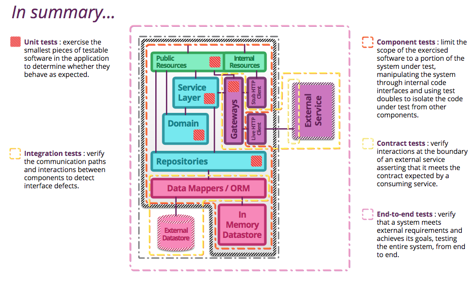

# microservice
## plan a monolithic application first
## event name : past action XXXChangedEvent
## message queue:
- avoid flat message
	- it might be better to notify that the user with the given __identifier__ has been updated, and leave the consumers to ask for the latest state whenever they decide to process their logic.
	- it’s more advisable to let the consumers ask for the data they need and avoid including it as part of the event’s content.
- log content: state changed event received: {}
## part  
- functional microservices (UI, backend)
- supporting microservices(api gateway, service registry, circuit breaker)

## test

### test requirement
- new api for test with test profiles eg.`@Profile("test")`
- test code with `@ActiveProfiles(profiles = "test")`

### test strategy
- unit test: mockist vs. classic
- integration test : datastores and external services
- component test: in or out of process?
- contract test: ensuring consistency across boundaries
- end-to-end test: tips and tricks

  
